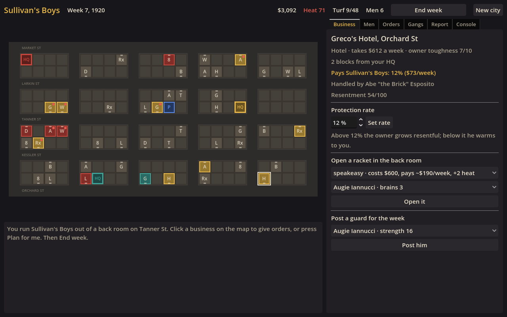
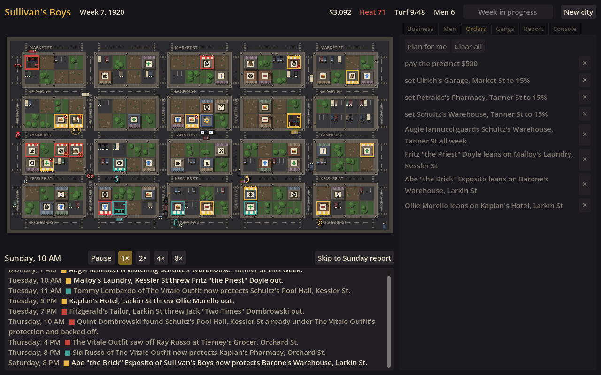
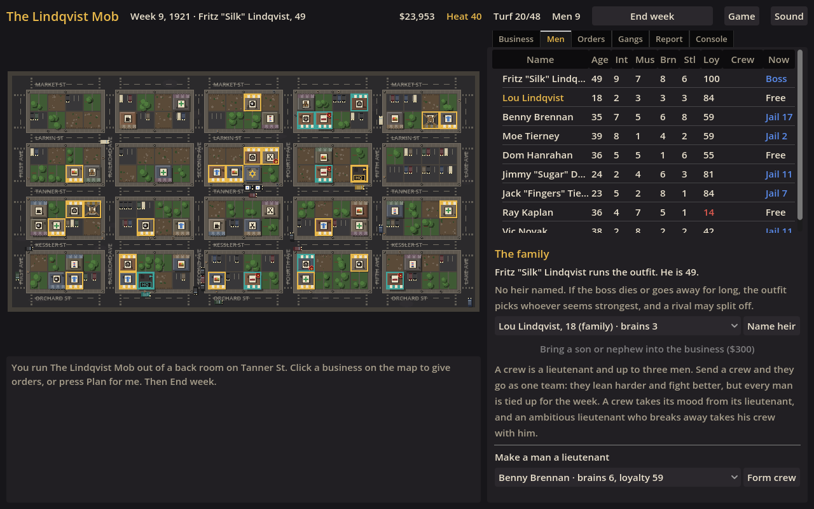
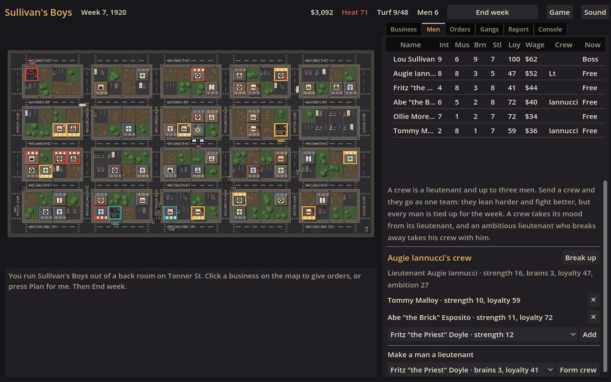
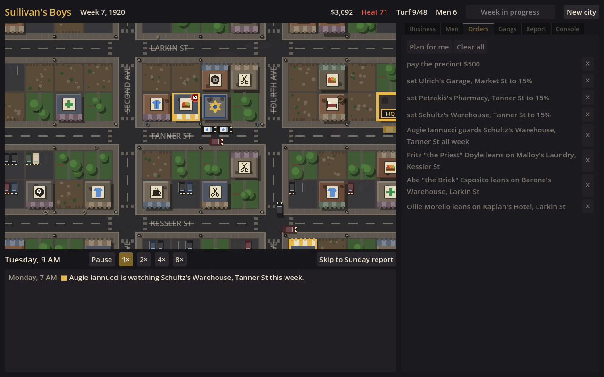
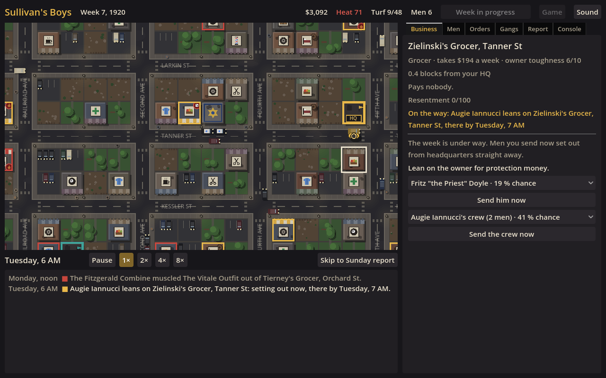
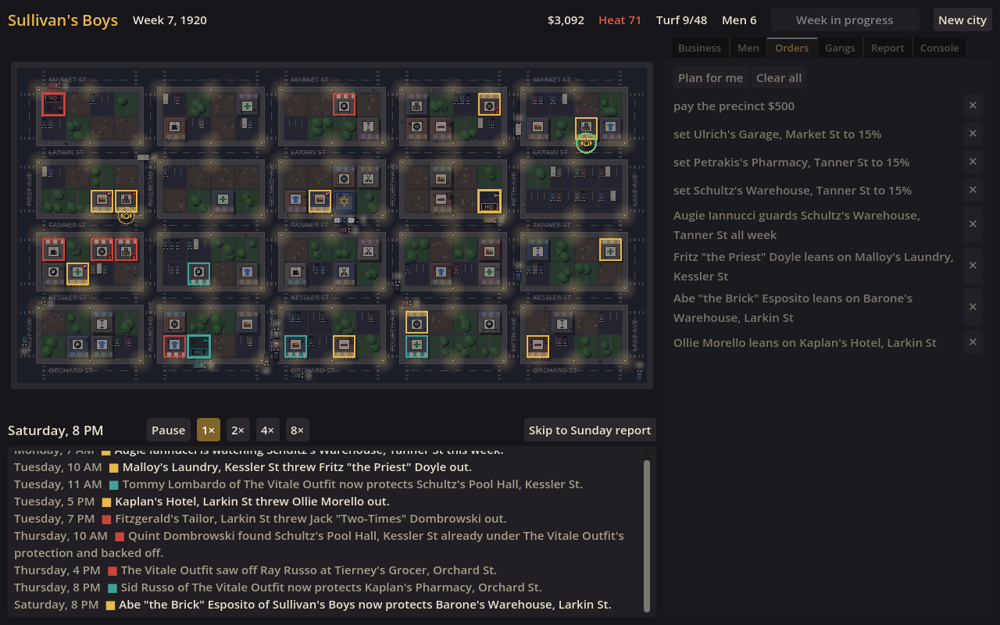

# Dry Town

An open-ended Prohibition-era crime strategy game, inspired by how *Gangsters: Organized Crime* (1998) plays. It is a new game. It uses none of the original's art, audio, text, code, data or name.

There is no win screen; the city keeps running. Phase 1 built the rules. Phase 2 made a week playable: you plan it on a district map, then watch it happen on the streets. Phase 3 made it a game you can keep coming back to. It saves itself every Sunday, you can run crews under lieutenants, you can step in during the week, and it has sound. Phase 4, the current state, lets the game outlive your boss. Men grow old and die, and the outfit passes to an heir, so one game can run through generations of a family.



## Layout

| Folder | What it is |
| --- | --- |
| `core/` | The simulation, in plain C# with no Godot dependency. All game rules live here. |
| `sim/` | Console runner: play in the terminal, or soak-test long games. |
| `tests/` | xUnit tests, including the Phase 1 gate (ten-year cities stay contested) and player survival. |
| `godot/` | Godot 4 (.NET) game: district map, planning panels, live week and Sunday report. |

## Run it

You need the [.NET 8 SDK](https://dotnet.microsoft.com/download/dotnet/8.0). To play the game, install the **.NET edition** of Godot 4.7, open `godot/project.godot` and press Play. If your editor is a different 4.x version, it updates the version in `DryTown.csproj` when it opens the project.

```sh
dotnet test tests                                                    # 34 tests
dotnet run --project sim -- play --seed 42                           # play in the terminal
dotnet run --project sim -- soak --seeds 40 --years 10               # balance check across many cities
dotnet run --project sim -- soak --seeds 40 --years 10 --difficulty Hard
```

## How a week works

1. **Plan (Monday morning).** Click a business on the map. If it pays nobody, send a man to lean on the owner; the panel shows his chance. If it pays a rival, send a man to take it, and the panel shows his odds if it is unguarded. On your own turf you can set the protection rate, open a racket in the back room, or post a guard for the week. The **Men** tab shows your roster and who is busy. On the **Orders** tab you can cancel orders, or press **Plan for me** to have the AI fill your week.
2. **Watch (Monday to Saturday).** Press **End week**. Each order happens at its own hour. Your men walk the streets from your headquarters to the job, and rival gangs and the police do the same. Rings show the outcome: green for success, red for a lost fight, blue for an arrest. A cross marks where someone died. Shops change colour as they change hands. The ticker logs each event as it happens. You can pause, play at 1×, 2×, 4× or 8×, or skip.
   **Stepping in.** Click a business at any time during the week and the clock pauses. You can send a free man or crew to lean on it, take it, or guard it for the rest of the week. They set out from headquarters straight away and the job happens when they arrive. You can also see rival men walking to their jobs, so you can try to get a guard to a shop before they reach it. New orders stop early on Sunday morning.
3. **Report (Sunday).** Collectors make their rounds, then the police, the Treasury and the gangs settle up. The **Report** tab shows the books and the week's headlines, with your own in bold.



## Bosses grow old

Every man has an age. Young men get better at the job each year, and men past 55 slow down. Anyone can die of natural causes, and the chance climbs steeply with age, so few bosses see 80.

On the **Men** tab, under **The family**, you can name the man who takes over when your boss dies or goes away for a long stretch. The heir learns the business while he waits, so his brains and other skills creep up. Naming him has a cost: the most ambitious man you passed over takes it badly. If you name nobody, the outfit settles on the obvious man once a year. Once a year you can also bring a son or nephew into the business. He starts young and green, but he's loyal and grows into the job, and family gets the nod when the chair is empty.

When your boss dies, a dialog tells you who runs the outfit now, and you carry on as him. The game is over only if nobody is left to take over.



## Crews

On the **Men** tab, make a man a lieutenant and give him up to three men. When you send a crew, the best man for the job goes in front and the rest back him up. A crew is more likely to make an owner pay, hits harder in a takeover and holds a guard post better. The catch is that every man in it is tied up for the week. A crew takes its mood from its lieutenant: a loyal one steadies his men and a sour one turns them. If an ambitious lieutenant breaks away, his crew goes with him.

Rival gangs send men in pairs and threes too, but only while they are small. A gang that already runs a large part of the district is spread too thin for it.



## Saving

The game saves itself every Sunday and when you close the window. Next time you open it, you carry on where you left off. The **Game** menu has three save slots, loading, and **New city**. Saves are JSON files in Godot's user folder, under `saves/`.

## Sound

There is a hot-jazz loop with stride piano, brushes and a muted trumpet, under a street ambience of traffic, voices, horns and a streetcar bell. Effects follow the action on the map: a shop bell when an owner pays, a slammed door when he refuses, gunshots in a takeover, whistles for arrests and raids, and the cash register on Sunday. Rivals' sounds play more quietly than yours. The **Sound** button sets the music and effects volumes and has a mute switch.

All of it is synthesised by `tools/make_audio.py` (Python and numpy) into `godot/audio/`. No recorded or third-party audio is used. Run `python3 tools/make_audio.py` to rebuild the files.

## The map

The map is drawn in code from simple shapes, so it uses no image files. Each business is a rooftop with a sign showing its trade, such as a barber pole, a coffee cup or a tyre for a garage. Its awning is striped in the colours of the gang it pays. A red badge on the roof marks a racket in the back room: a bottle for a speakeasy, a copper pot for a still, a die for numbers and a coin for loans. The empty lots are parks, parking lots and vacant ground. Each gang headquarters has a neon sign and the boss's car parked outside, and the precinct house has patrol cars at the kerb. Traffic and people on the pavements keep the streets moving. During the live week the light follows the clock, so streetlamps and shop windows come on at dusk.

Scroll to zoom, and drag with the right or middle mouse button to pan. Trackpad pinch and two-finger scroll also work.





The **Console** tab and `sim play` take the same text orders: `extort <hood> <business>`, `racket <hood> <business> <kind>`, `guard <hood> <business>`, `recruit`, `bribe <dollars>`, `rate <business> <percent>`, `crews`, `crew new <hood>`, `crew add <crew> <hood>`, `send <crew> <business>`, `post <crew> <business>`, `auto`, `end`.

## Systems

- **The district.** It is a grid of 20 blocks and 160 lots. 48 of them are businesses, and the rest are empty lots, gang headquarters and the precinct house. Owners take a gang less seriously the further its headquarters is: each block beyond the second costs a few points of extortion chance.
- **Protection.** A hood leans on a shop. Success depends on his Intimidation against the owner's toughness. Higher rates pay more but build resentment, and resentful owners talk to the police.
- **Rackets.** These hide behind protected businesses: speakeasies, stills, numbers games and loan books. Liquor rackets only pay well until repeal in 1934.
- **Turf wars and guards.** A hood sent at a rival's business fights whoever answers the door. That is the guard posted there, otherwise the business's handler. A guard fights harder than a handler who gets called in. The rest of the rival gang only backs him up if it isn't spread thin. Losers can die.
- **Heat.** Rackets, violence and sheer size draw police attention. High heat brings raids, fines, closed rackets and arrests. Bribes cool it.
- **Feds.** Treasury tax cases hit gangs holding large amounts of cash. They can't be bribed, they seize money, and they can send the boss away.
- **Loyalty.** Unpaid wages and big gangs breed restless lieutenants. An ambitious one can break away with a faction and the businesses its members handle. A boss who dies or gets a long sentence is succeeded, and a rival heir may split the gang.
- **The rival director.** If one gang holds most of the district, the director sows dissent in that gang and brings in an aggressive outside syndicate sized to challenge it. It also steps in if the district goes quiet or if fewer than two gangs are left. Rival gangs with no men, turf or money fold to make room.
- **Difficulty.** On Easy and Normal the player starts with more men and money than the rivals, and rivals hold back from the player's turf for the first year or two. Hard starts everyone level.

## Balance checks

All gangs, including the player's, were run by the AI planner. A city counts as stalled if, in any year, it has fewer than two gangs at some point, one gang holds over 75% of the district all year, or fewer than 3 businesses change hands.

| Check | Result |
| --- | --- |
| 10-year cities contested, seeds 1–80 (Normal) | 80/80 |
| 10-year cities contested, seeds 1–40 (Hard) | 40/40 |
| 50-year cities contested, seeds 1–10 | 10/10 |
| Player's gang alive after 3 / 10 years, seeds 1–80 (Normal) | 71/80 / 55/80 |
| Player's gang alive after 3 / 10 years, seeds 1–40 (Hard) | 27/40 / 25/40 |
| Player's gang alive after 50 years, seeds 1–10 (Normal) | 3/10 |

Phase 3 on the same 80 Normal seeds kept the player's gang alive in 69/80 after 3 years and 58/80 after 10, and in 1/10 after 50 years. The game now loses some bosses to old age, but heirs and family make up for it, and long games survive more often.

The AI is a cautious but simple player; a person paying attention should do better.

## Not done yet

- **Mid-week saves.** If you quit during the live week, you go back to that week's Monday and your orders for it are lost.
- **Crews in the console.** `crews`, `crew new|add|drop`, `send <crew> <biz>` and `post <crew> <biz>` work, but the in-game console only queues orders. It can't send men during the live week.
- **Rival crews.** Rivals put together backup for a single job but don't keep standing crews or lieutenants.
